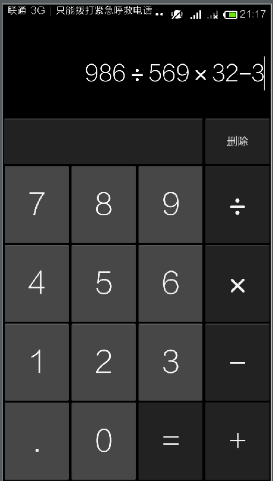

# Android 4.4 计算器源代码

本计算器代码是直接从Android 4.4代码中直接抽离出来的，因为编译整个Android系统太费劲了。主要是为了供大家学习和
使用其里面的一些重要的东西，同时如果我们要开发更复杂的计算器的话，也可以在此代码上进行修改定制的，这样子就不用
重复的造轮子了。

本项目总共分为三个模块：app(主代码)，arity(计算器的一些逻辑算法)，guava(这个也是系统中的)，
calculator.apk是我直接编译的apk，可能大家会因为一些原因而导致代码编译不过去，但是又苦于不能看到编译后的效果，
所以我这里就把结果放出来了。
编译注意：
1. 这里我建议大家使用buidl-tools:19.1.0，因为是Android4.4的代码，所以如果你用高版本的编译工具编译的话，
则会出现一些问题的。

2. 在app/libs 目录下有两个已经编译好的jar包，其中 arity-2.1.2.jar是源代码中自带的，由于没有源代码所以我就在github
上找到了其源代码方便查看其源代码; google-collections.jar 该jar包是我在网上查找的一个包，该包是google的一个开源的
collection扩展包，有效地丰富了目前JDK中的collections的操作方式，Google又一精品设计。其源代码用的Android源代码的guava模块的
所以google-collections.jar的源代码跟guava是一样的，只是google-collections.jar精简了一些类，没有这么大的，如果在实际使用的
话，可以直接使用.jar了。

## 效果图样子

下面我们来看看编译完成之后的效果图如何的

